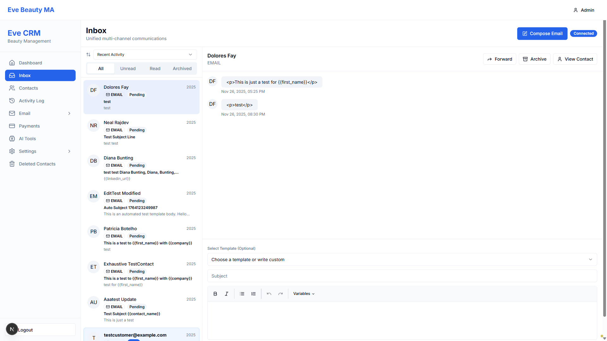

# BUG-2a Visual Evidence - Archived Tab Empty

## The Problem in Screenshots

### BEFORE: Thread Visible in All Tab

- Dolores Fay thread is selected (highlighted in list)
- Archive button visible in toolbar
- Ready to archive

### AFTER: Archived Tab Shows "No conversations"

- "Archived" tab is selected (highlighted)
- Thread list shows: **"No conversations"**
- Detail pane shows stale content (Dolores Fay) from before archiving
- **THE BUG:** No threads appear in the Archived threads list

### UNEXPECTED: Thread Reappears in All Tab

- After clicking back to "All" tab
- Dolores Fay thread is BACK in the list
- Status still shows "Pending"
- Suggests archive action did not persist

## The Core Issue

```
EXPECTED BEHAVIOR:
1. Click Archive button
2. Thread moves to Archived tab
3. Archived tab shows the thread in its list
4. Can click thread to view/unarchive

ACTUAL BEHAVIOR:
1. Click Archive button ✓
2. UI switches to Archived tab ✓
3. Archived tab shows "No conversations" ✗ BUG
4. Thread reappears in All tab ✗ NEW BUG
```

## Why TypeScript Fix Didn't Work

The fix changed:
```typescript
archived: filters.archived === 'true' || filters.archived === true
```

But this only fixes TYPE HANDLING. It doesn't fix:
- Thread fetching logic
- Filter application
- UI rendering of archived threads
- Archive persistence to database

## Required Fix

The coder needs to debug:
1. `fetchThreads()` method with archived filter
2. API endpoint response for archived=true
3. Thread list rendering logic
4. Archive action persistence

