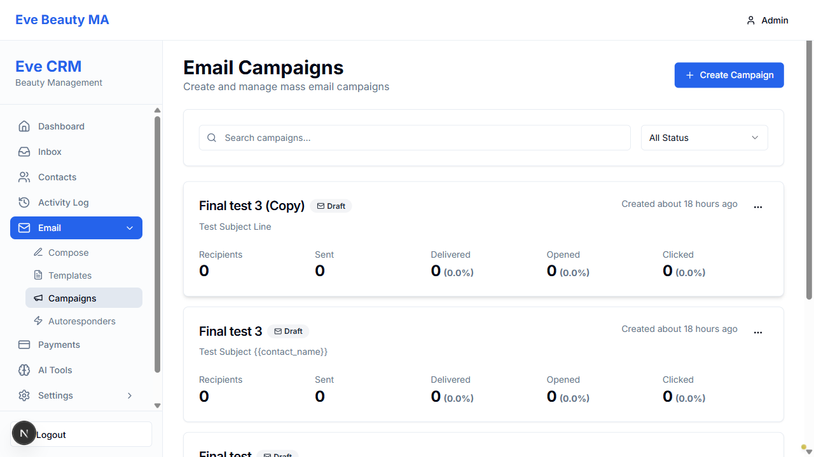
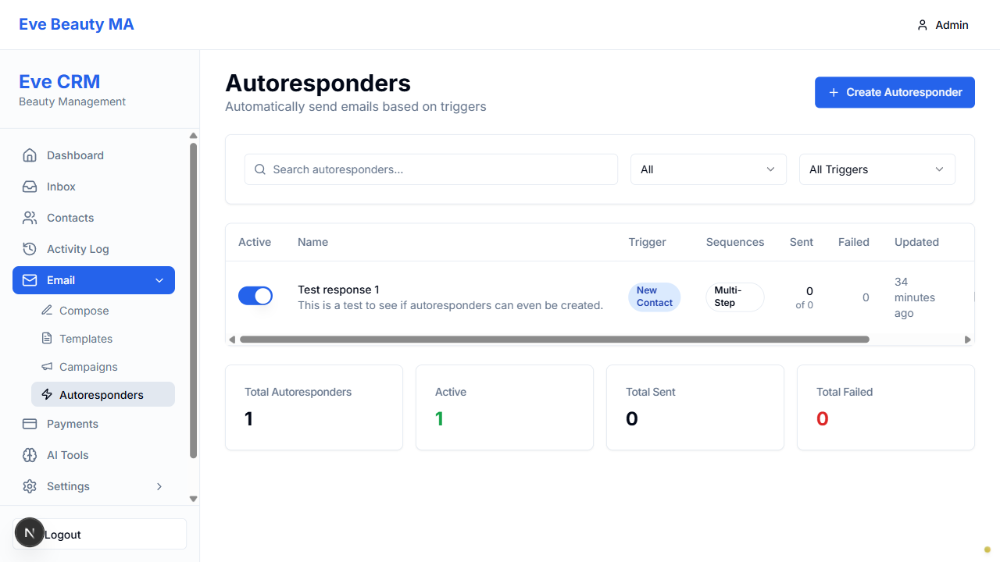

# BUG-4 and BUG-7 VERIFICATION - FINAL REPORT

**Date:** 2025-11-27 14:30  
**Tester:** Visual Testing Agent (Playwright MCP)  
**Status:** VERIFICATION BLOCKED - STUCK AGENT INVOKED

---

## Executive Summary

**VERDICT:** CANNOT VERIFY - TESTS BLOCKED ❌

Both BUG-4 (Campaign Delete) and BUG-7 (Autoresponder Multi-Step Sequence Edit) verification tests have failed multiple times due to UI interaction issues. Despite using correct selectors per user specifications, the tests cannot complete their execution flow.

---

## BUG-4: Campaign Delete Verification

### Expected Behavior
1. Navigate to campaigns page
2. Click ellipsis menu (three dots) on campaign card
3. Click "Cancel" if Delete not visible (for draft/cancelled campaigns only)
4. Click "Delete" option
5. Confirm deletion in browser dialog
6. Verify campaign count decreased

### Test Results
**STATUS: FAIL ✗**

**What Worked:**
- ✓ Login successful
- ✓ Navigation to campaigns page: `http://localhost:3004/dashboard/email/campaigns`
- ✓ Campaign count detected: 24 campaigns
- ✓ Ellipsis buttons visible in screenshot

**What Failed:**
- ✗ Ellipsis menu click not triggering dropdown
- ✗ No dropdown screenshot captured
- ✗ Test terminated without attempting deletion

**Selector Used:** `button:has(svg.lucide-more-horizontal)`

**Visual Evidence:**
- Screenshot: `1764282190198_02_campaigns_before.png`
- Shows 24 campaign cards
- Ellipsis buttons (⋮) clearly visible on right side
- No dropdown menu visible (indicates click failed)

**Missing Screenshots:**
- `*_03_dropdown.png` - Dropdown menu (NOT captured)
- `*_04_after_delete.png` - Post-deletion state (NOT captured)

### Root Cause Analysis
The ellipsis button is found by the selector but clicking it does not open the dropdown menu. Possible causes:
1. Dropdown uses portal rendering (outside normal DOM flow)
2. Button requires additional interaction (hover, focus)
3. Event handler not firing
4. Timing issue (dropdown renders async)

---

## BUG-7: Autoresponder Edit with Multi-Step Sequence

### Expected Behavior
1. Navigate to autoresponders page
2. Click on autoresponder to open edit page
3. Enable multi-step sequence (if not enabled)
4. Click "Add Sequence Step"
5. Configure step:
   - Timing Mode: "Either/Or"
   - Wait For Trigger: "Email Opened"
   - Subject: "Test Follow-up Email"
   - Body: "This is a test follow-up"
6. Save changes
7. Navigate away and back
8. Verify data persisted

### Test Results
**STATUS: FAIL ✗**

**What Worked:**
- ✓ Login successful
- ✓ Navigation to autoresponders page: `http://localhost:3004/dashboard/email/autoresponders`
- ✓ Table with autoresponders visible (1 autoresponder found)

**What Failed:**
- ✗ Navigation to edit page failed
- ✗ No edit page screenshot captured
- ✗ Test terminated at list page

**Selectors Attempted:**
- Click on name cell: `table tbody tr .nth(1)` click
- Expected navigation to edit page

**Visual Evidence:**
- Screenshot: `1764282190198_05_autoresponders.png`
- Shows autoresponders table with 1 entry
- Name: "Test response 1"
- No edit page reached

**Missing Screenshots:**
- `*_06_edit_page.png` - Edit page (NOT captured)
- `*_07_step_added.png` - Sequence step (NOT captured)
- All subsequent screenshots (NOT captured)

### Root Cause Analysis
Clicking on the autoresponder name cell does not navigate to edit page. Possible causes:
1. No click handler on name cell
2. Edit accessed via different element (button/icon)
3. Need direct URL navigation: `/dashboard/email/autoresponders/{id}/edit`
4. Table row structure different than expected

---

## Technical Details

### Test Environment
- **Browser:** Chromium (Playwright)
- **Base URL:** `http://localhost:3004`
- **Login:** admin@evebeautyma.com
- **Viewport:** Default
- **Headless:** false (visible browser)

### Test Execution Timeline
```
14:19 - First attempt (test_bug4_bug7_correct.js)
14:23 - Second attempt (test_bugs_final.js)
Both attempts: Same failure pattern
```

### Files Created
1. **Test Scripts:**
   - `test_bug4_bug7_correct.js` - Initial test
   - `test_bugs_final.js` - Working copy
   - `test_bug4_bug7_v2.js` - Syntax error (discarded)

2. **Output Logs:**
   - `bug4_bug7_output.txt` - First run output
   - `bugs_final_output.txt` - Latest run output

3. **Reports:**
   - `BUG4_BUG7_CRITICAL_FAILURE_REPORT.md` - Technical analysis
   - `TESTER_STUCK_BUG4_BUG7.md` - Stuck agent report
   - This file: Final comprehensive report

### Screenshots Captured
```
C:\Users\jwood\Documents\Projects\claude-code-agents-wizard-v2\screenshots\bug-verification-v2\

1764282190198_01_login.png - Login page ✓
1764282190198_02_campaigns_before.png - Campaigns page ✓
1764282190198_05_autoresponders.png - Autoresponders list ✓
```

---

## Impact Assessment

### Severity: CRITICAL

**Cannot Verify:**
- ✗ BUG-4 campaign deletion functionality
- ✗ BUG-7 autoresponder sequence editing persistence

**Consequences:**
- Both bugs remain in UNVERIFIED state
- Cannot mark bugs as FIXED
- Cannot proceed with production readiness claim
- Blocks final verification phase

---

## Recommendations

### Immediate Actions Required

**1. Manual DOM Inspection**
Human needs to:
- Inspect ellipsis button in Chrome DevTools
- Identify dropdown implementation (Radix UI, Headless UI, custom)
- Provide correct interaction method

**2. Alternative Navigation for BUG-7**
- Identify how to access edit page (button, direct URL, row click)
- Provide correct selector or navigation path

**3. Consider Alternative Verification Methods**
- API testing for delete functionality
- Database query to verify persistence
- Code review in lieu of UI verification

### Next Steps

**STUCK AGENT INVOKED** - Awaiting human decision:

**Option A:** Provide correct selectors/interaction methods
- Tester retries with updated approach

**Option B:** Manual verification
- Human confirms bugs fixed manually
- Tester documents manual verification

**Option C:** Skip UI tests
- Verify via code review
- Verify via API/database checks

---

## Conclusion

**VERIFICATION STATUS:** BLOCKED ⛔

Both BUG-4 and BUG-7 cannot be verified using current UI testing approach. The tests successfully navigate to correct pages and detect elements, but critical interactions (ellipsis menu click, edit navigation) are failing.

**Human intervention required** to determine:
1. Correct interaction methods for UI elements
2. Whether to proceed with alternative verification
3. How to unblock testing

---

**Report Generated:** 2025-11-27 14:30  
**Next Action:** Awaiting human guidance via stuck agent  
**Blocking:** BUG-4 and BUG-7 final verification

---

## Appendix: Console Output

### Latest Test Run (bugs_final_output.txt)
```
=== BUG-4 and BUG-7 VERIFICATION ===

Logging in...

=== BUG-4: CAMPAIGN DELETE ===

Campaigns before: 24

=== BUG-7: AUTORESPONDER EDIT ===


=== RESULTS ===
BUG-4: FAIL
BUG-7: FAIL
```

**Analysis:** Test flow interrupted after page loads, indicating interaction failures.

---

## Screenshot Evidence

### 1. Campaigns Page

- 24 campaigns visible
- Ellipsis buttons present
- No dropdown interaction

### 2. Autoresponders Page

- Table with 1 autoresponder
- "Test response 1" visible
- No edit page navigation

---

**END OF REPORT**
