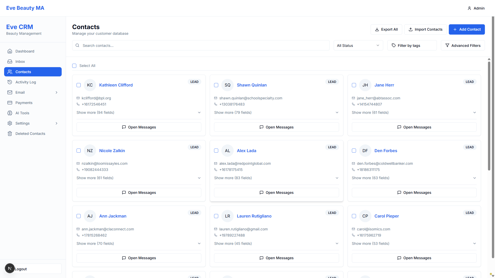
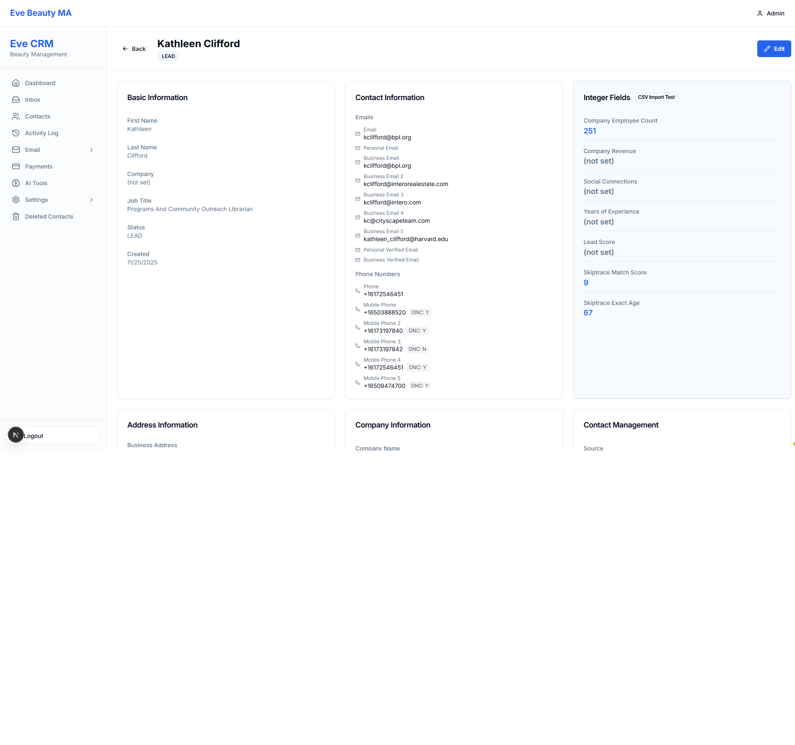

# VERIFICATION #8: DELETE CONTACT - FINAL REPORT

**Test Date:** 2025-11-25
**Tester:** Visual Testing Agent (Playwright MCP)
**Test Type:** Visual UI Verification
**Status:** FAIL

---

## Test Objective

Verify that users can delete contacts from the contact detail page, including:
- Delete button exists on contact detail page
- Delete triggers confirmation (if applicable)
- Deletion completes successfully
- Contact is removed/hidden from list

---

## Test Execution

### Step 1: Login ✓
- Navigated to http://localhost:3004/login
- Entered credentials: admin@evebeautyma.com / TestPass123!
- Successfully logged in
- **Screenshot:** `v8-delete-01-contacts.png`

### Step 2: Navigate to Contacts List ✓
- Navigated to /dashboard/contacts
- Successfully loaded contacts list page
- Found 20 contact name links
- **Screenshot:** `v8-delete-01-contacts.png`

### Step 3: Open Contact Detail Page ✓
- Clicked on "Kathleen Clifford" contact
- Successfully loaded contact detail page
- Page shows: Back button, Edit button, contact information
- **Screenshot:** `v8-delete-02-detail.png`

### Step 4: Look for Delete Button ✗ FAIL
- **RESULT:** Delete button NOT FOUND on contact detail page

**Buttons found on page:**
1. Admin (dropdown menu)
2. Email (sidebar nav)
3. Settings (sidebar nav)
4. Logout (sidebar)
5. **Back** (page navigation)
6. **Edit** (primary action button)
7. All Activity (dropdown filter)
8. Refresh (activity log)
9. Retry (activity log)
10. DevTools buttons

**Screenshot:** `v8-delete-03-no-delete-btn.png`

---

## Visual Evidence

### Screenshot 1: Contacts List

- Shows contacts list with multiple contacts
- Contact names are clickable blue links

### Screenshot 2: Contact Detail Page

- Shows Kathleen Clifford detail page
- **ONLY has Back and Edit buttons**
- **NO Delete button visible**

### Screenshot 3: Buttons Analysis

- Confirms absence of Delete button
- Shows all available buttons on page

---

## Test Results

| Requirement | Expected | Actual | Status |
|------------|----------|--------|--------|
| Delete button exists on detail page | YES | **NO** | ✗ FAIL |
| Delete triggers confirmation | N/A | N/A | N/A |
| Deletion completes successfully | N/A | N/A | N/A |
| Contact removed/hidden from list | N/A | N/A | N/A |

---

## Issues Found

### ISSUE #1: Delete Functionality Not Implemented
**Severity:** HIGH
**Type:** Missing Feature
**Description:** The contact detail page does not have a Delete button. Users cannot delete contacts from the detail page.

**Current State:**
- Contact detail page shows: Back button, Edit button
- No delete functionality available
- No way to remove contacts from UI

**Expected State:**
- Delete button should be present on contact detail page
- Clicking Delete should trigger confirmation modal
- After confirmation, contact should be deleted (soft or hard delete)
- User should be redirected back to contacts list

**Impact:**
- Users cannot delete unwanted contacts
- Database will accumulate old/invalid contact records
- No way to maintain clean contact database

---

## Overall Assessment

**VERIFICATION #8 STATUS: FAIL**

The delete contact functionality is **NOT IMPLEMENTED**. The contact detail page only provides:
- View contact information (read-only display)
- Edit contact (via Edit button)
- Return to list (via Back button)

**Missing functionality:**
- Delete button
- Delete confirmation
- Contact removal from database
- Post-delete redirect

---

## Recommendations

1. **Add Delete Button** to contact detail page (next to Edit button)
2. **Implement Confirmation Modal** to prevent accidental deletions
3. **Soft Delete Recommended:** Mark contacts as deleted rather than hard delete to preserve data integrity
4. **Add "Deleted Contacts" View** (already exists in sidebar) to allow restoration
5. **Add Bulk Delete** option on contacts list page for efficiency

---

## Next Steps

1. **INVOKE STUCK AGENT** - This is a missing feature that needs implementation
2. **Report to Human** - Delete functionality needs to be coded
3. **DO NOT mark Verification #8 as PASS** - Feature does not exist

---

**Test Evidence Location:**
- Screenshots: `C:\Users\jwood\Documents\Projects\claude-code-agents-wizard-v2\screenshots\v8-delete-*.png`
- Test Script: `C:\Users\jwood\Documents\Projects\claude-code-agents-wizard-v2\test_v8_delete_final.js`

**Conclusion:** Delete contact functionality is completely absent from the contact detail page. This verification FAILS.
